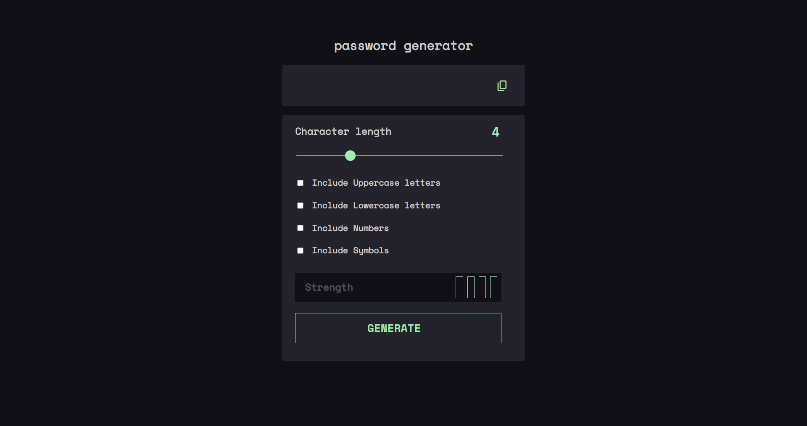
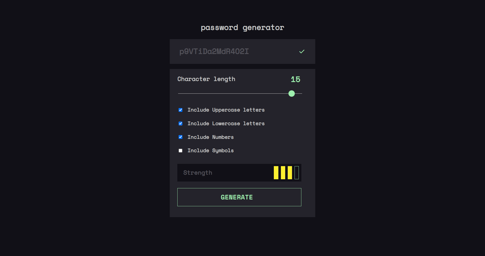

# JavaScript Password Generator

This is a simple password generator built using JavaScript. This project is designed to generate a random password based on the user's preferences for length and character types.

## Screenshots
- initial page

 
 

- after password generation

 

## live links
- <a href="https://password-generator-ebon-two.vercel.app/" target = "_blank">Password Generator</a>

## How to Use
To use this password generator, simply follow these steps:

- Download or clone the repository to your local machine.
- Open index.html in your preferred browser.
- Select the desired password length (between 8 and 128 characters).
- Choose which character types you would like to include in your password (lowercase letters, uppercase letters, numbers, and special characters).
- Click the "Generate" button to generate your password.
- Copy the generated password to your clipboard.

## Features
- Allows the user to select a password length of upto 16 characters.
- Allows the user to select which character types to include in the password (lowercase  letters, uppercase letters, numbers, and special characters).
- Generates a random password that meets the user's selected criteria.

## Technologies Used
- HTML
- CSS
- JavaScript

# Contributing
Contributions to this project are welcome. If you find a bug or have an idea for a new feature, please submit an issue or pull request.

# Author
 
 This project was developed by:

 Jeff Gichuki

# License
This project is licensed under the MIT License. See the LICENSE file for details.